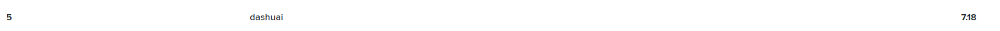
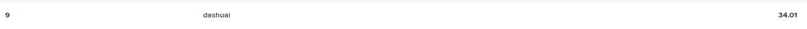
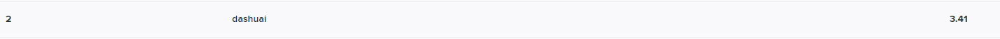

-----------------

[](https://github.com/qdslovelife/bustub/actions/workflows/codev.yml)
[](https://github.com/qdslovelife/bustub/actions/workflows/windows.yml)
[](https://codecov.io/gh/xiaoshuai98/bustub)

BusTub is a disk-oriented relational database management system built at [Carnegie Mellon University](https://db.cs.cmu.edu) for the [Introduction to Database Systems](https://15445.courses.cs.cmu.edu) (15-445/645) course.

## Gradescope

**As for November 30, 2021.**

- [x] Buffer Pool Manager 
- [x] Hash Index 
- [x] Query Execution 
- [x] Concurrency Control (No LeaderBoard)

## Build

### Linux

To ensure that you have the proper packages on your machine, run the following script to automatically install them.

Note: This script will install gtest using [vcpkg](https://github.com/microsoft/vcpkg).

```
$ sudo build_support/packages.sh
```

Then run the following commands to build the system:

```
$ mkdir build
$ cd build
$ cmake -DCMAKE_BUILD_TYPE=Debug -GNinja ..
$ ninja
```

### Windows

```
$ .\build_support\packages.bat
```

Use visual studio to open the folder, then you're done.

Note: The version of visual studio I am using is [Visual Studio Community 2022 preview](https://visualstudio.microsoft.com/zh-hans/vs/)

## Format

```
$ cd build
$ ninja format
```

## Static Analysis

```
$ cd build
$ ninja check-lint
$ ninja check-clang-tidy
```

## Testing

```
$ cd build
$ ninja check-tests
```
